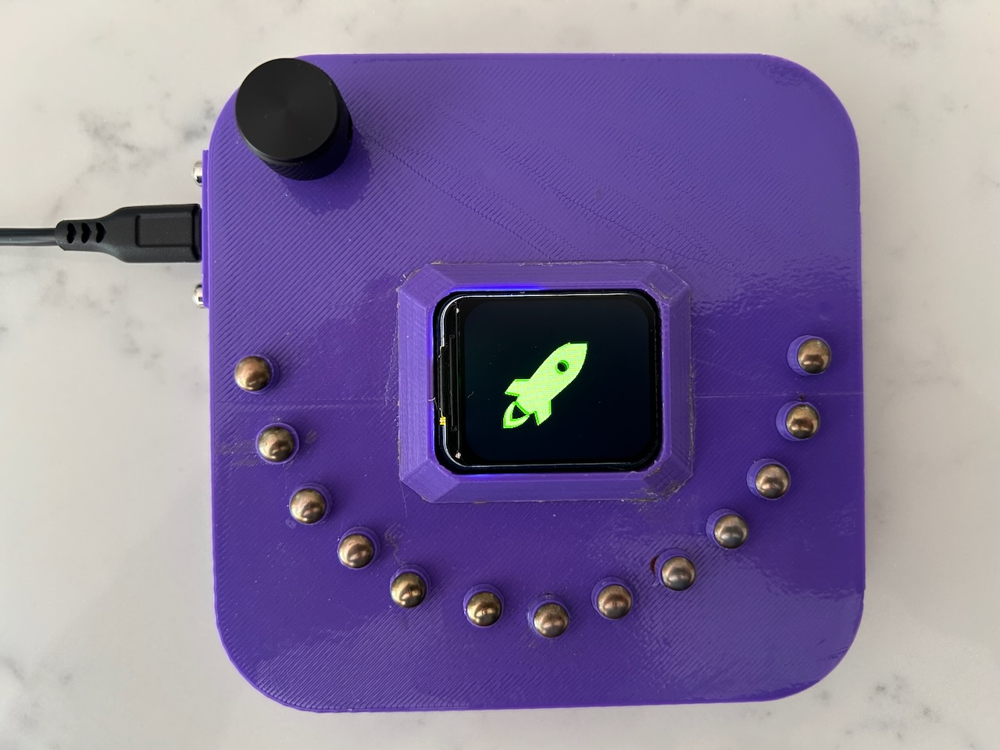
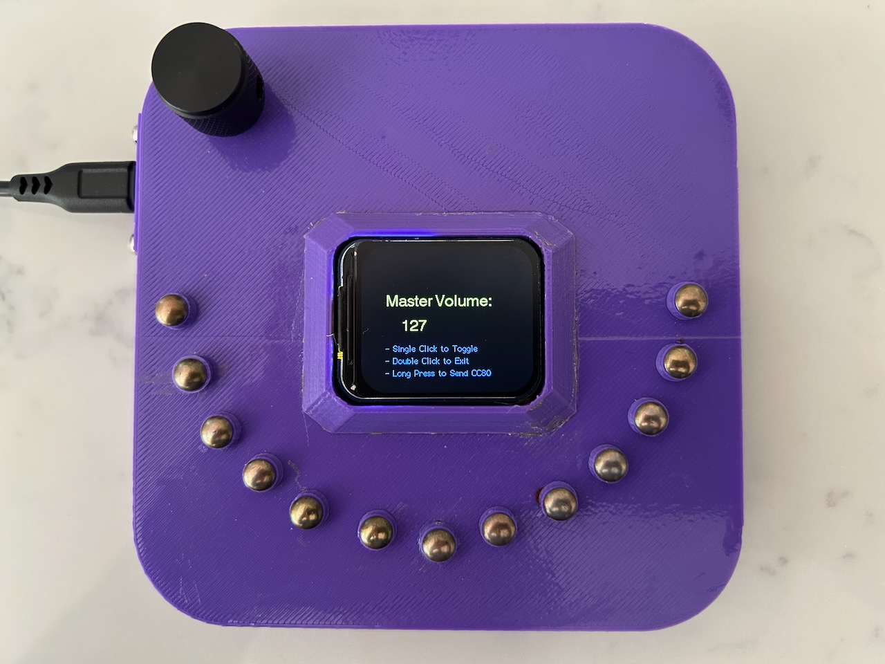
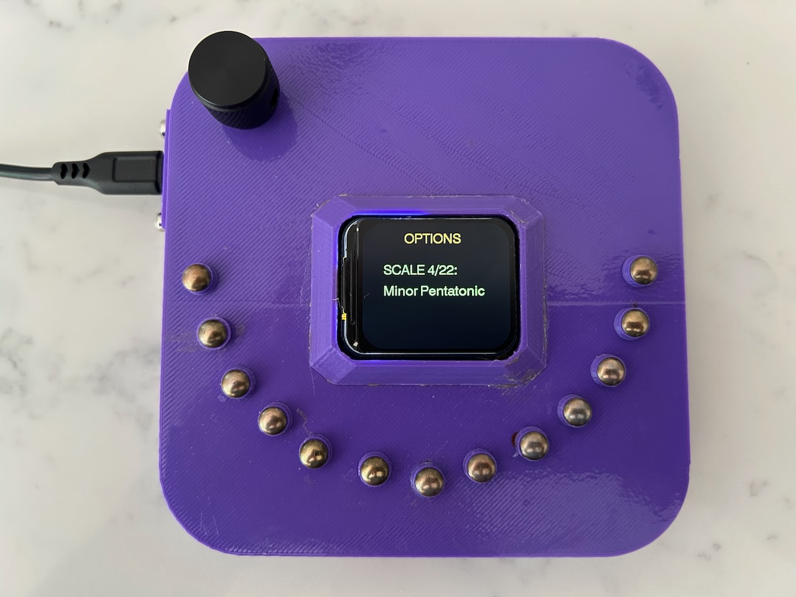
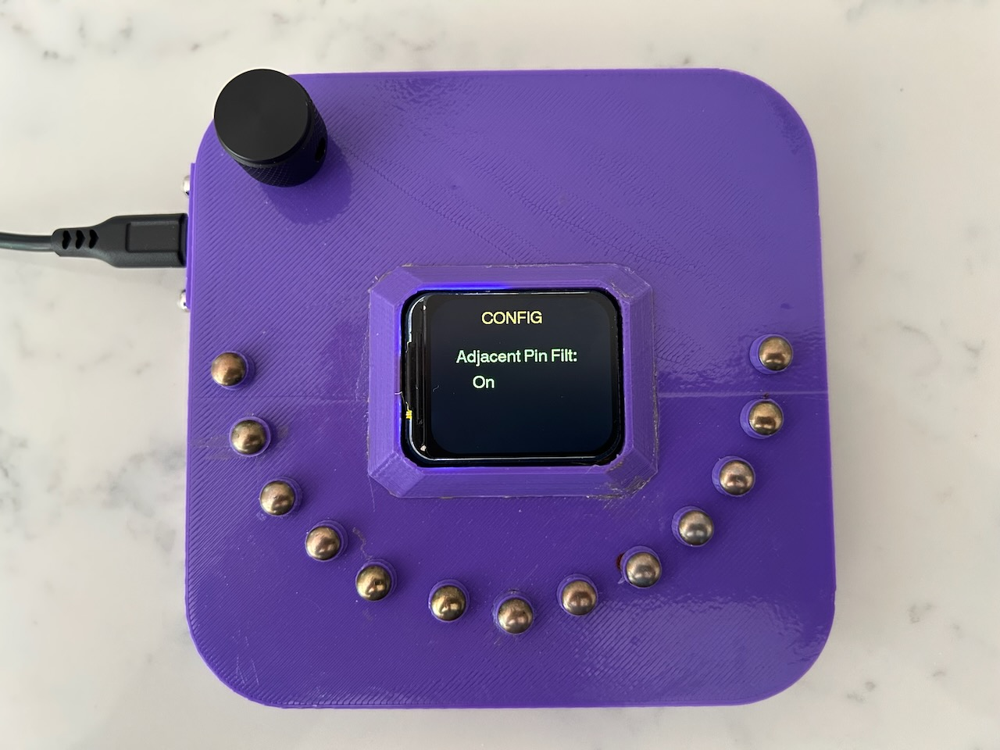
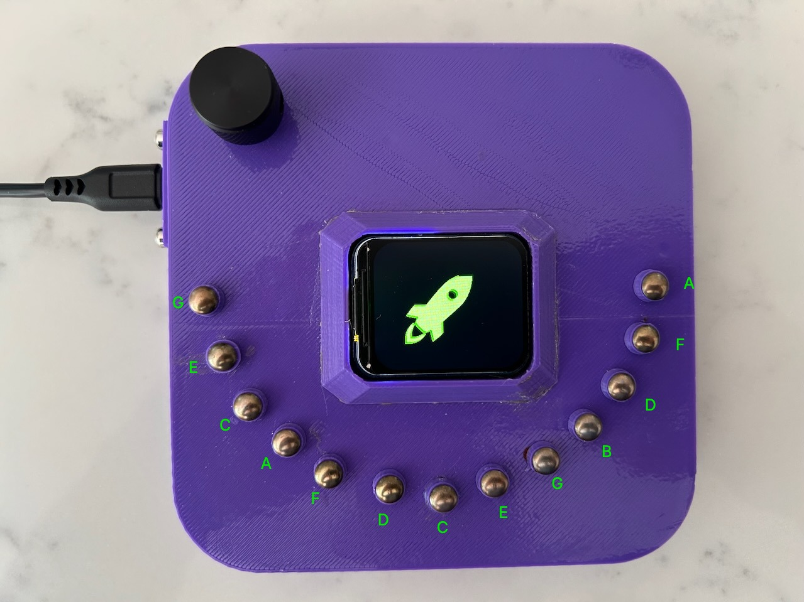
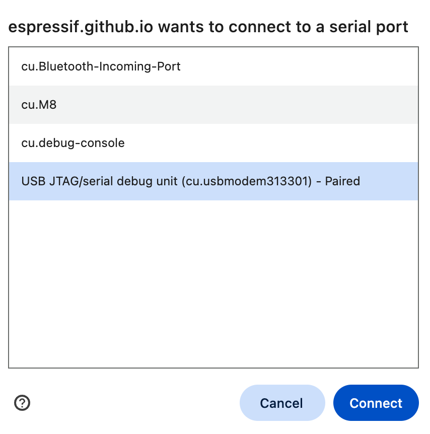

# EMMMA-K-Mini

# Introduction
The EMMMA-K-Mini is a MIDI controller for electronic music that uses touch pins for note keys and for effects such as pitch bend and modwheel.

This is a newer and smaller version of the previous EMMMA-K which can be found here:

[https://github.com/RocketManRC/EMMMA-K-V3-M](https://github.com/RocketManRC/EMMMA-K-V3-M)

# Differences From Previous Version

- Much more compact form factor.
- Uses a single ESP32-S3 microcontroller which makes it easier to build albeit 13 note pins instead of 17.
- Colour LCD display.
- Rotary encoder for user interface (UI) instead of touch pins.
- Default UI page is note velocity (volume).

# User Interface

## Startup Page

This is showing the MIDI velocity (a.k.a. note volume). There are two settings for this to select a high and low volume. A single press on the rotary encoder toggles betweem the two. Rotating the encoder will change the value of the setting.

## Options Mode

A double press on the encoder will switch to Options mode. Rotate the encoder to select the option to change and then single press the encoder to change the option by rotating.

The three options that can be changed are:
- Scale (22 variations).
- Key (C, C#, D, etc).
- Octave (relative to scale starting with MIDI value 60).

A single encoder press on the notes page will display the note being played. Single press again to get back to selecting the options page. 

A single encoder press on the master volume page will get back to the UI the way it was at startup (~~NOTE this will also have the effect of unintentionally toggling between the low and high velocities which is a fault that needs to be fixed~~ Fixed in v2.0.2).

## Config Mode

A long press when in Options Mode will change to Config Mode (~~NOTE this doesn't work when in Options Mode and displaying the Master Volume page. Another fault to be fixed!~~ Fixed in v2.0.2).

The four configs that can be changed are:

- Adjacent Pin Filter (when set on which is the default will prevent notes playing from accidentally touching and adjacent pin). In general you will want this to be on to make the keyboard easier to play.
- Dissonant Notes Filter (the default is off).
- MIDI Channel (default is 1).
- Modwheel CC value (default is 1).
- Wireless mode (ESP-Now to use the wireless hub or BLE to use Bluetooth Low Energy).

To get out of the config menu select either the page "Exit NO Save" or "Save & Exit". "Save" means to save the startup values but in either case the current values will be changed. If the wireless mode has been changed then the system will restart on exit even with "Exit NO Save" (~~yet another fault to fix~~ Fixed in v2.0.2 now only restarts if config saved).

Note that the Key and Scale will be saved on "Save & Exit" but not the Octave.

# How to Play the Keyboard

This is modelled after the Kalimba. The root note of a scale is played by touching the middle pin with your right thumb then the next note of the scale will be the next pin to the left touched with your left thumb. Alternating pins on each side will play the full scale.

The following image shows the notes for each pin when in the C Major Scale.

# Pitch Bend, Modwheel and Chords

There is a touch pin on the right hand side of the case (effects pin) that has 3 functions:

- Holding the pin with your finger will enable Pitch Bend and Modwheel. Then tilting the unit forward and back will cause a pitch bend and tilting the unit to the left and right will change the modwheel (typically used to change a paramter such filter cutoff in the connected synthesizer).
- Tapping the pin will toggle the relative major or minor scale for the Major, Minor, Major Pentatonic and Minor Pentatonic scales (colour of the title on the display will toggle between green and blue).
- A long press of the pin will toggle between note and chord mode but again just for the Major, Minor, Major Pentatonic and Minor Pentatonic scales. In this case the colour of the display will toggle between red and purple when toggling between the major and minor relative scales).

Note that there is a scale called "Custom" and one called "Custom Alt". These are currently hardcoded to be Major and Major Pentatonic scales allowing to switch between those two with the effects pin.

# Updating Firmware

This has to be carried out on a computer (not a mobile device) using one of the following web browsers: Chrome, Edge or Opera.

1. Download the firmware.bin file from the releases page.
2. Connect the EMMMA-K Mini to your computer using a USB cable (must support data transfer as well as power).
3. Navigate to this page on the web browser: [https://espressif.github.io/esptool-js/](https://espressif.github.io/esptool-js/).
4. Press the Connect button.
5. On the pop-up window pick the device that looks similar to the one shown selected in this image:  and press connect.
6. In the box labelled "Flash Address" add a zero to the value so that it is 0x10000.
7. Press the button Chose File and pick the file firmware.bin that was downloaded in step 1. Press Open.
8. Press Program

